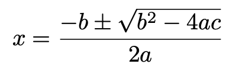

# Nullpunkter til et andregradspolynom

## Oppgave

En andregradslikning på formen:

kan ha to, en eller ingen løsninger. Lag et program som ber brukeren om å taste inn faktorene a, b og c og så skriver ut løsningen(e) hvis de finnes.

## Ressurser

* Du trenger en kodeeditor og Python til denne oppgaven.

## Vurderingskriterier

* Programmet skal kjøre uten feil og advarsler.
* Det skal komme klart frem av programkode og kommentarer hvordan du har løst problemet.

## Kompetansemål

* omgjøre problemstillinger til konkrete delproblemer, vurdere hvilke delproblemer som lar seg løse digitalt, og utforme løsninger for disse
* bruke grunnleggende programmering som variabler, datatyper, løkker, tester, plotting, tilfeldige tall, funksjoner og enkel brukerinteraksjon
* lage strukturerte og oversiktlige programmer med hensiktsmessige kommentarer

---

_Denne oppgaven er laget av [fuzzbin](https://github.com/fuzzbin) og [bitjungle](https://github.com/bitjungle). Oppgaven er lisensiert under en [Creative Commons Navngivelse-DelPåSammeVilkår 4.0 Internasjonal lisens.](http://creativecommons.org/licenses/by-sa/4.0/)_
