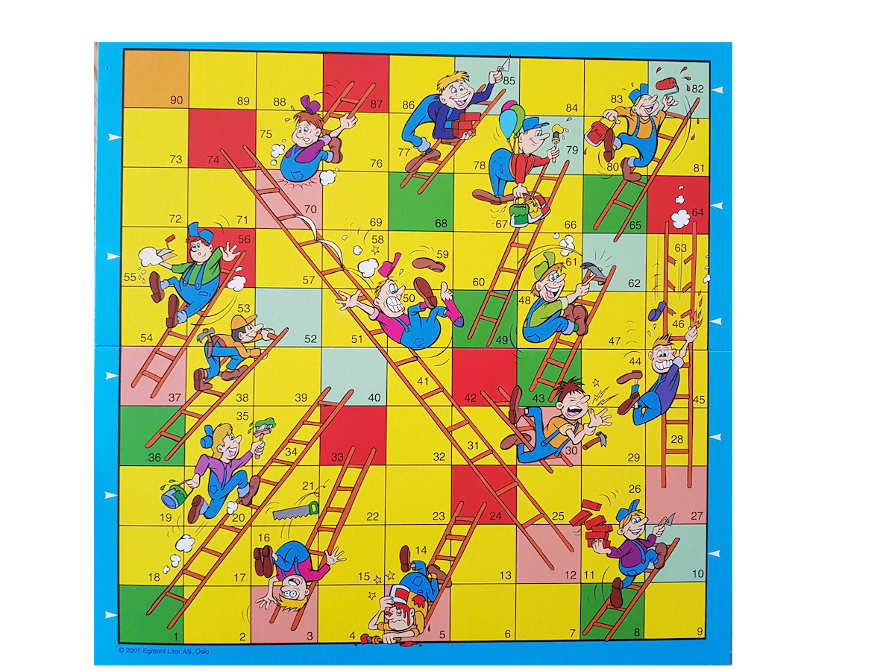

# Stigespillet

## Oppgave

Lag et program som beregner hvor mange terningkast man i gjennomsnitt må bruke for å komme i mål.

## Ressurser

* Du trenger en kodeeditor og Python til denne oppgaven.

## Vurderingskriterier

* Programmet skal kjøre uten feil og advarsler.
* Programmet skal skrive ut gjennomsnitlig antall kast man må bruke for å fullføre spillet.
* Det skal komme klart frem av programkode og kommentarer hvordan du har løst problemet.

## Kompetansemål

* omgjøre problemstillinger til konkrete delproblemer, vurdere hvilke delproblemer som lar seg løse digitalt, og utforme løsninger for disse
* bruke grunnleggende programmering som variabler, datatyper, løkker, tester, plotting, tilfeldige tall, funksjoner og enkel brukerinteraksjon
* lage strukturerte og oversiktlige programmer med hensiktsmessige kommentarer

---

_Denne oppgaven er laget av [fuzzbin](https://github.com/fuzzbin) etter en ide fra [bitjungle](https://github.com/fuzzbin) og [Henrik Kjønnerud](henrikk@vfk.no). Oppgaven er lisensiert under en [Creative Commons Navngivelse-DelPåSammeVilkår 4.0 Internasjonal lisens.](http://creativecommons.org/licenses/by-sa/4.0/)_
