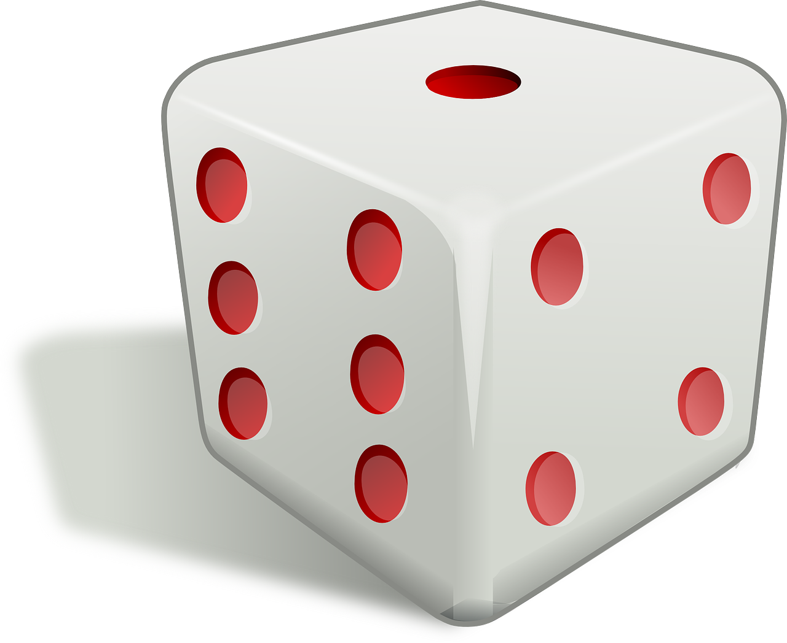

# Terningkast

Om du kaster en sekskantet terning, vet du sikkert at det er &frac16; sannsynlighet for å få et spesifikt utfall. Hva skjer om du kaster terningen 60 ganger, vil du få hvert av de seks mulige utfallene nøyaktig 10 ganger?

<figure>
    
    <figcaption>Seks-sidet terning</figcaption>
</figure>

## Oppgave

Du skal lage et program som simulerer terningkast. Start med å gjøre 60 simuleringer, og plott resultatet i et histogram. Øk antallet kast gradvis, og gjør en vurdering av hvor mange kast du må simulere for å få omtrent like mange av hvert mulige utfall.

## Vurderingskriterier

* Programmet skal kjøre uten feil og advarsler.
* Programmet skal følge reglene for spillet.
* Programmet skal skrive ut gjennomsnittlig antall kast man må bruke for å fullføre spillet. Det skal også skrives ut hvor mange simuleringer som er kjørt.
* Programmet skal be brukeren om å angi antall simuleringer.
* Det skal komme klart frem av programkode og kommentarer hvordan du har løst problemet.

## Kompetansemål

* omgjøre problemstillinger til konkrete delproblemer, vurdere hvilke delproblemer som lar seg løse digitalt, og utforme løsninger for disse
* bruke grunnleggende programmering som variabler, datatyper, løkker, tester, plotting, tilfeldige tall, funksjoner og enkel brukerinteraksjon
* lage strukturerte og oversiktlige programmer med hensiktsmessige kommentarer
